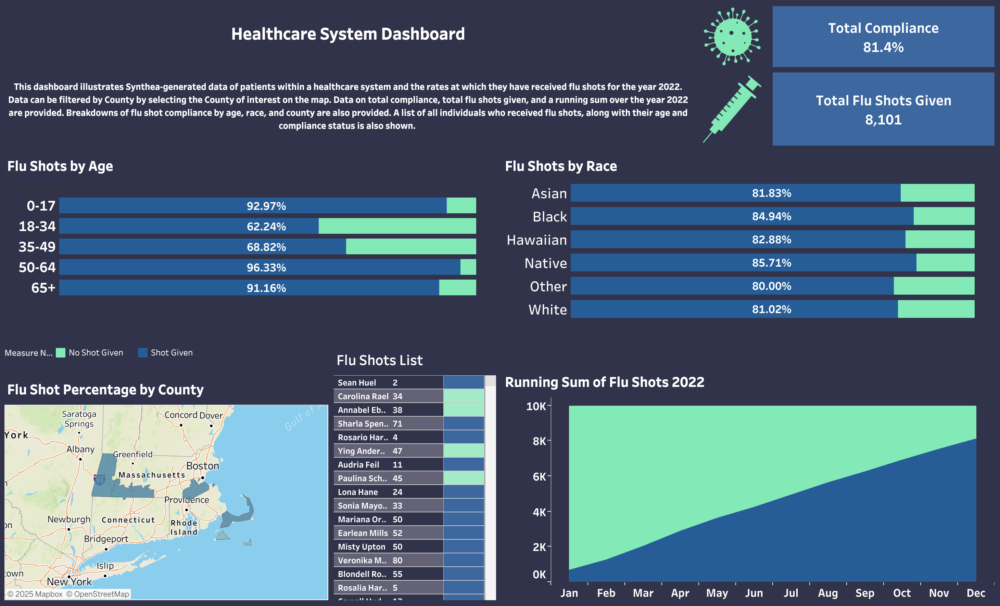

# 2022 Flu Shot Compliance Dashboard

This repository contains an interactive dashboard visualizing flu shot compliance using Synthea-generated patient data from a simulated healthcare system. The dashboard focuses on immunization rates for the year 2022, highlighting trends and disparities across age, race, and geography.

## Dashboard Features

- Flu shot compliance rates by county (displayed on a map)
- Dynamic filtering of compliance by county
- Stratified compliance by age and race
- Running total of flu shots administered over the course of 2022
- Overall flu shot compliance percentage
- Patient-level table listing demographics and flu shot status

## Tools Used

- PostgreSQL (via pgAdmin 4) for querying and data preparation
- Tableau for interactive data visualization

## Dataset

- **Source**: [Synthea](https://synthetichealth.github.io/synthea/) – open-source synthetic health records
- **Scope**: Simulated patient encounters and immunizations from 2020 through 2022
- **Inclusion Criteria**:
  - Patients must have had at least one healthcare encounter between 2020 and 2022
  - Patients must be alive as of the end of 2022
  - Only patients aged six months or older are included (per flu shot guidelines)

## SQL Logic

The SQL code used to prepare the dashboard dataset is included in [`immunization_dashboard_queries.sql`](./immunization_dashboard_queries.sql). Key steps include:

1. Filtering for active patients
2. Identifying patients who received flu shots in 2022
3. Calculating patient age as of December 31, 2022
4. Joining demographic, geographic, and healthcare utilization data into a single table for use in Tableau

## Tableau Dashboard

[View the Interactive Dashboard on Tableau Public](https://public.tableau.com/views/ImmunizationDashboard_17399922248810/Dashboard1?:language=en-US&:sid=&:redirect=auth&:display_count=n&:origin=viz_share_link)

<em>Click the image to view the dashboard</em>

## Summary

This project analyzes flu shot compliance using synthetic electronic health record data. The dashboard provides a visual summary of who is receiving flu shots and where, allowing users to explore immunization patterns by county, age, and race. This work demonstrates how SQL and Tableau can be used together to extract insights from large datasets and communicate them effectively.

## Skills Demonstrated

- Data extraction, transformation, and filtering using SQL in PostgreSQL
- Analyzing health-related data for patterns and disparities
- Designing effective and informative dashboards in Tableau
- Communicating insights through structured documentation and visualization
